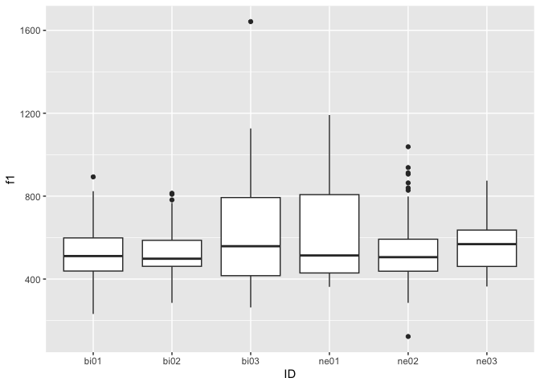
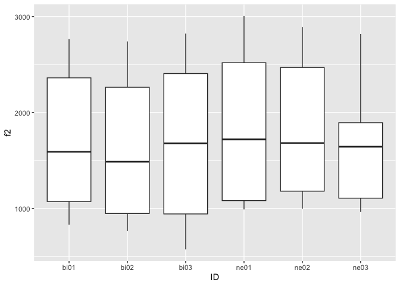
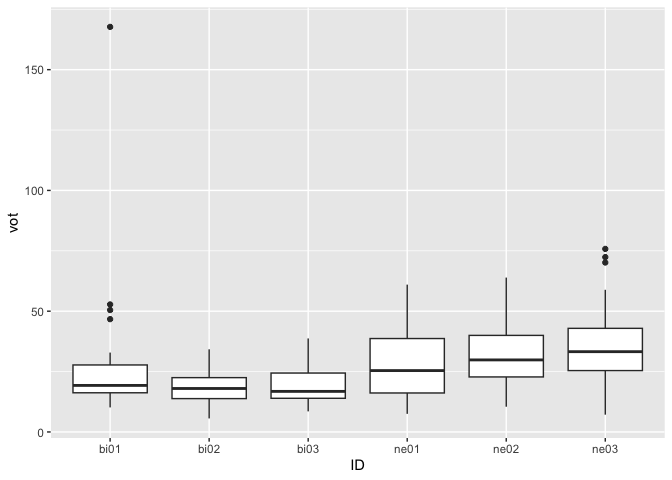

Programming assignment 4
================

**Author**: Yhosep Barba  
**Date**: Last update: 2024-04-15 12:49:44.809465

# Overview

<!-- 
  Talk briefly about what you did here 
  Describe your hypotheses
-->

Monolingual English speakers would have a higher VOT. Bilinguals would
have a shorter or similar VOT to monolingual Spanish Speakers (if
existed). They would also show more control over F1 and F2 frequencies,
exhibiting a broader vowel space in their pronounciation skills. All of
this taking into account previous and more exposure to the Spanish
language.

# Prep

## Libraries

``` r
library(tidyverse)
```

    ## ── Attaching core tidyverse packages ──────────────────────── tidyverse 2.0.0 ──
    ## ✔ dplyr     1.1.4     ✔ readr     2.1.5
    ## ✔ forcats   1.0.0     ✔ stringr   1.5.1
    ## ✔ ggplot2   3.4.4     ✔ tibble    3.2.1
    ## ✔ lubridate 1.9.3     ✔ tidyr     1.3.1
    ## ✔ purrr     1.0.2     
    ## ── Conflicts ────────────────────────────────────────── tidyverse_conflicts() ──
    ## ✖ dplyr::filter() masks stats::filter()
    ## ✖ dplyr::lag()    masks stats::lag()
    ## ℹ Use the conflicted package (<http://conflicted.r-lib.org/>) to force all conflicts to become errors

## Load data

``` r
df <- list.files(path="../data", full.names= TRUE) %>%
  lapply(read_csv) %>%
  bind_rows() 
```

    ## Rows: 45 Columns: 5
    ## ── Column specification ────────────────────────────────────────────────────────
    ## Delimiter: ","
    ## chr (2): fileID, notes
    ## dbl (3): f1, f2, vot
    ## 
    ## ℹ Use `spec()` to retrieve the full column specification for this data.
    ## ℹ Specify the column types or set `show_col_types = FALSE` to quiet this message.
    ## Rows: 45 Columns: 5
    ## ── Column specification ────────────────────────────────────────────────────────
    ## Delimiter: ","
    ## chr (1): fileID
    ## dbl (3): f1, f2, vot
    ## lgl (1): notes
    ## 
    ## ℹ Use `spec()` to retrieve the full column specification for this data.
    ## ℹ Specify the column types or set `show_col_types = FALSE` to quiet this message.
    ## Rows: 45 Columns: 5
    ## ── Column specification ────────────────────────────────────────────────────────
    ## Delimiter: ","
    ## chr (1): fileID
    ## dbl (3): f1, f2, vot
    ## lgl (1): notes
    ## 
    ## ℹ Use `spec()` to retrieve the full column specification for this data.
    ## ℹ Specify the column types or set `show_col_types = FALSE` to quiet this message.
    ## Rows: 45 Columns: 5
    ## ── Column specification ────────────────────────────────────────────────────────
    ## Delimiter: ","
    ## chr (1): fileID
    ## dbl (3): f1, f2, vot
    ## lgl (1): notes
    ## 
    ## ℹ Use `spec()` to retrieve the full column specification for this data.
    ## ℹ Specify the column types or set `show_col_types = FALSE` to quiet this message.
    ## Rows: 45 Columns: 5
    ## ── Column specification ────────────────────────────────────────────────────────
    ## Delimiter: ","
    ## chr (1): fileID
    ## dbl (3): f1, f2, vot
    ## lgl (1): notes
    ## 
    ## ℹ Use `spec()` to retrieve the full column specification for this data.
    ## ℹ Specify the column types or set `show_col_types = FALSE` to quiet this message.
    ## Rows: 45 Columns: 5
    ## ── Column specification ────────────────────────────────────────────────────────
    ## Delimiter: ","
    ## chr (1): fileID
    ## dbl (3): f1, f2, vot
    ## lgl (1): notes
    ## 
    ## ℹ Use `spec()` to retrieve the full column specification for this data.
    ## ℹ Specify the column types or set `show_col_types = FALSE` to quiet this message.
    ## Rows: 5 Columns: 1
    ## ── Column specification ────────────────────────────────────────────────────────
    ## Delimiter: ","
    ## chr (1): data
    ## 
    ## ℹ Use `spec()` to retrieve the full column specification for this data.
    ## ℹ Specify the column types or set `show_col_types = FALSE` to quiet this message.

## Tidy data

``` r
df2 <- df %>%
  separate("fileID", c("ID","Word")) %>%
  select(-c(notes,data)) %>%
  na.omit()
```

# Analysis

## Descriptives

``` r
means <- df2 %>%
  group_by(ID) %>%
  summarize(avg_f1 = mean(f1),
            sd_f1 = sd(f1),
            avg_f2 = mean(f2),
            sd_f2 = sd(f2),
            avg_vot = mean(vot),
            sd_vot = sd(vot))
 knitr::kable(means) 
```

| ID   |   avg_f1 |    sd_f1 |   avg_f2 |    sd_f2 |  avg_vot |    sd_vot |
|:-----|---------:|---------:|---------:|---------:|---------:|----------:|
| bi01 | 520.2511 | 138.3988 | 1727.237 | 666.6207 | 26.19733 | 23.572779 |
| bi02 | 520.0707 | 135.4996 | 1581.053 | 680.7059 | 18.77089 |  6.791174 |
| bi03 | 623.8144 | 266.4369 | 1719.455 | 717.4848 | 19.55489 |  7.750767 |
| ne01 | 615.7502 | 241.1618 | 1863.086 | 725.4263 | 28.29533 | 14.593920 |
| ne02 | 541.9136 | 202.0233 | 1836.614 | 655.5262 | 32.66689 | 13.637155 |
| ne03 | 573.3058 | 145.4476 | 1641.234 | 574.6544 | 35.11000 | 15.866022 |

## Visualization

``` r
df2 %>%
   ggplot() +
   aes(x = ID, y = f1) +
   geom_boxplot() +
   labs(x = "ID", y = "f1") 
```

<!-- -->

``` r
df2 %>%
   ggplot() +
   aes(x = ID, y = f2) +
   geom_boxplot() +
   labs(x = "ID", y = "f2")
```

<!-- -->

``` r
df2 %>%
   ggplot() +
   aes(x = ID, y = vot) +
   geom_boxplot() +
   labs(x = "ID", y = "vot")
```

<!-- -->

<!-- 
Also include a professional looking figure illustrating an example of the acoustics 
of the production data, i.e., a plot generated in praat.
You decide what is relevant (something related to your hypothesis). 
Think about where this file should be located in your project. 
What location makes most sense in terms of organization? 
How will you access the file (path) from this .Rmd file?
If you need help consider the following sources: 
  - Search 'Rmarkdown image' on google, stackoverflow, etc.
  - Search the 'knitr' package help files in RStudio
  - Search the internet for HTML code (not recommended, but it works)
  - Check the code from my class presentations (may or may not be helpful)
-->

<figure>
<embed src="/Users/diegomedina/Desktop/pa_4/soundwave.pdf" />
<figcaption aria-hidden="true">An image</figcaption>
</figure>

## Hypothesis test

``` r
# Conduct a simple statistical analysis here (optional)
```

# Conclusion

<!-- 
Revisit your hypotheses (refer to plots, figures, tables, statistical tests, 
etc.)
&#10;Reflect on the entire process. 
What did you enjoy? What did you hate? What did you learn? 
What would you do differently?
-->

To conclude, there is variability in the average F1 and F2 frequencies
among the six participants. L2 learners and bilinguals exhibit different
patterns of vowel production. I believe that with only six participants,
it is difficult to determine and/or categorize vowel formants. On the
other hand, VOT results matched with the hypothesis: bilinguals portray
a shorter VOT compared to L2 learners. Further information would be
required if we want to include exposure as an independent variable.

I enjoyed the process, I believe it was really interesting to see how,
through some scripts, you are able to segment different audios (this
saves a lot of time). I still struggle a little bit in understanding how
codes and scripts work. I guess I would have to instruct myself during
summer and find the logic behind it. In addition to this, I find R very
useful, although I hate that even small mistakes do not allow to run
some instructions. If I had to do something different, I would include
colors to my graphs.

</br></br>
